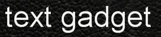
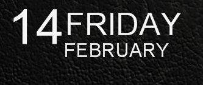
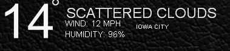
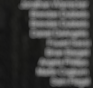

win7-chromecast- gadgets
=======================

A collection of windows 7 gadgets inspired by the default tv display on chromecast

### development / grunt tasks

`grunt copy` copies the gadgets to your appdata gadget dir

`grunt build` creates *.gadget files for each of the gadgets

## Text

allows you to display any text you would like

## Date

display the current date

## Weather

display the current weather data from the open weather api

weather has a [bug where](https://github.com/jebaird/win7-chromecast-gadgets/issues/1) it doesn't update randomly

## Pidglet

Displays a current list of your contacts that are online. Its an alternate display for this [plugin](plugin)

It depends on this pidgin plugin being installed and working [https://code.google.com/p/pidglet/](https://code.google.com/p/pidglet/)

### pink background

This is a bug with the windows sidebar and html elements with transparency. I've tried to use the text api with the html click handlers but it doesn't seem to want to work together. 

## What about a clock?

[Presto's Sidebar Clock](http://prestonhunt.com/story/110) is one of the best windows gadgets avaliable. And can be easily configured to look like the other widgets in this repo. 
